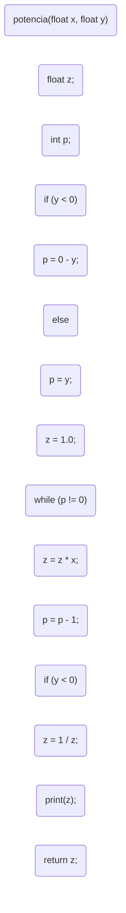

```mermaid
flowchart LR

	A("potencia(float x, float y)")
	B("float z;")
	C("int p;")
	D("if (y < 0)")
	E("p = 0 - y;")
	F("else")
	G("p = y;")
	H("z = 1.0;")
	I("while (p != 0)")
	J("z = z * x;")
	K("p = p - 1;")
	L("if (y < 0)")
	M("z = 1 / z;")
	N("print(z);")
	O("return z;")
```