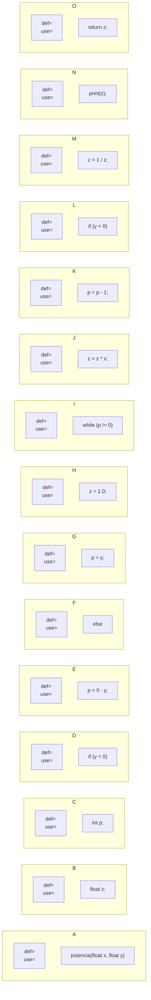

```mermaid
flowchart LR

            subgraph A
                direction TB 
                A_du["def= <br> use=  "] 
                A_code["potencia(float x, float y) "] 
            end 

            subgraph B
                direction TB 
                B_du["def= <br> use=  "] 
                B_code["float z; "] 
            end 

            subgraph C
                direction TB 
                C_du["def= <br> use=  "] 
                C_code["int p; "] 
            end 

            subgraph D
                direction TB 
                D_du["def= <br> use=  "] 
                D_code["if (y < 0) "] 
            end 

            subgraph E
                direction TB 
                E_du["def= <br> use=  "] 
                E_code["p = 0 - y; "] 
            end 

            subgraph F
                direction TB 
                F_du["def= <br> use=  "] 
                F_code["else "] 
            end 

            subgraph G
                direction TB 
                G_du["def= <br> use=  "] 
                G_code["p = y; "] 
            end 

            subgraph H
                direction TB 
                H_du["def= <br> use=  "] 
                H_code["z = 1.0; "] 
            end 

            subgraph I
                direction TB 
                I_du["def= <br> use=  "] 
                I_code["while (p != 0) "] 
            end 

            subgraph J
                direction TB 
                J_du["def= <br> use=  "] 
                J_code["z = z * x; "] 
            end 

            subgraph K
                direction TB 
                K_du["def= <br> use=  "] 
                K_code["p = p - 1; "] 
            end 

            subgraph L
                direction TB 
                L_du["def= <br> use=  "] 
                L_code["if (y < 0) "] 
            end 

            subgraph M
                direction TB 
                M_du["def= <br> use=  "] 
                M_code["z = 1 / z; "] 
            end 

            subgraph N
                direction TB 
                N_du["def= <br> use=  "] 
                N_code["print(z); "] 
            end 

            subgraph O
                direction TB 
                O_du["def= <br> use=  "] 
                O_code["return z; "] 
            end 
```